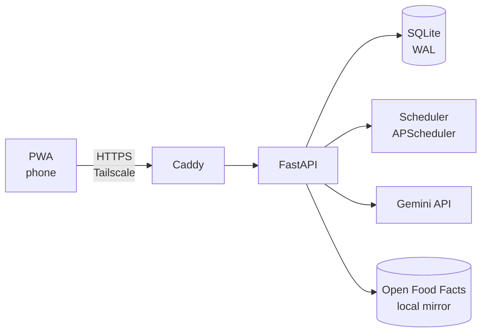
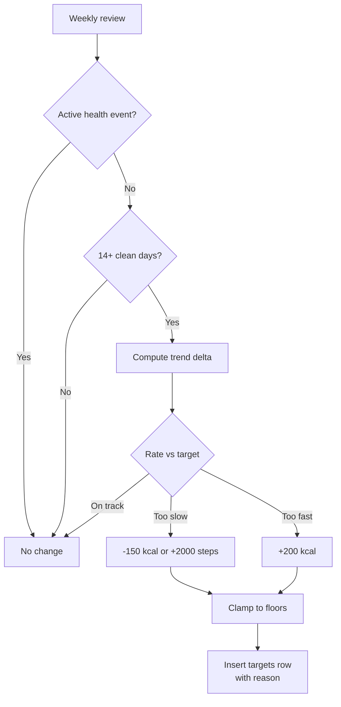
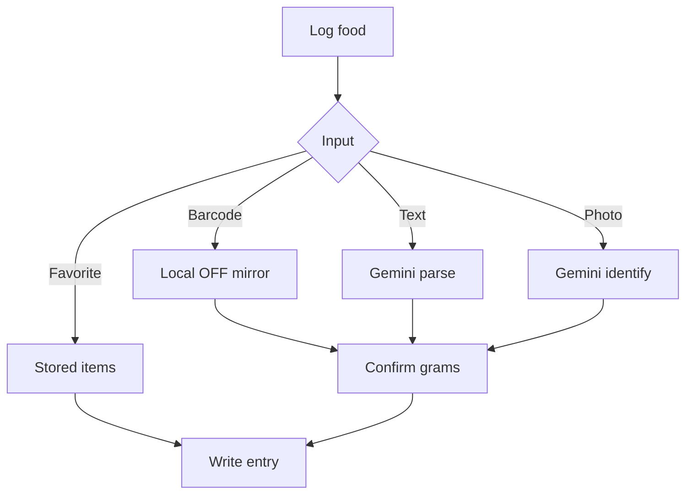
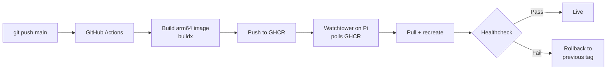

# Health Platform — Build & Deploy Spec (Pi 5)

2026-09-20 · @Someone

> Implementation spec written to be handed directly to Claude Code. Target: self-hosted adaptive nutrition and training tracker on a Raspberry Pi 5 (4GB), with a Gemini layer for interpretation and a deterministic engine for all arithmetic.

## 1. Purpose and the one rule

Build a single-user, self-hosted health platform that tracks nutrition and training, learns actual maintenance calories from observed data, and adjusts targets weekly. It runs on a Raspberry Pi 5 (4GB) and is reachable from a phone as an installable web app.

**The rule that governs the whole design: the LLM never performs arithmetic and never sets a target.**

| Layer | Owns | Never does |
| --- | --- | --- |
| Deterministic engine (Python) | TDEE, trend weight, target adjustment, progression, mode rules, all guardrails | Interpret free text, identify food |
| Gemini layer | Food identification, text parsing, narrative summaries, answering questions about stored data | Compute any number written to `targets`, `daily_rollup`, or a guardrail |

Every number the user acts on must be traceable to a row and a formula. Gemini output is always parsed into a structured record, validated against bounds, then handed to the engine. If Gemini is unavailable the app degrades to manual entry and keeps working — a hard requirement, not an aspiration.

**Scope:** one user. No multi-tenancy, no social features, no account system beyond a single API token. Do not build for scale that will never arrive.

## 2. App or website: build a PWA

**Decision: an installable Progressive Web App served from the Pi. Not native, not a plain website.**

A PWA is a website that installs to the home screen, runs full-screen without browser chrome, works offline, and reaches the camera. For a single-user self-hosted tool it wins on every axis that matters here.

| Option | Camera | Offline | Install to home screen | Push | Cost to ship | App Store review |
| --- | --- | --- | --- | --- | --- | --- |
| Plain website | Yes | No | No | No | Lowest | None |
| PWA | Yes (`getUserMedia`) | Yes (service worker) | Yes | Yes (iOS 16.4+) | Low | None |
| React Native / Flutter | Yes | Yes | Yes | Yes | High | Needed for iOS |

Native would cost a rewrite, an Apple Developer account at 99 USD a year, and a review cycle — to gain a marginally better camera API for one user. Rejected.

**Known PWA limits, and the workarounds:**

- iOS push requires the app be installed to the home screen first. Prompt for install on first run.
- iOS evicts service-worker storage after roughly 7 days of no use. Never treat the client cache as the source of truth; the Pi holds all state.
- Background sync is unreliable on iOS. Flush the offline queue on app focus instead of relying on background events.
- Barcode scanning uses the native `BarcodeDetector` API where available, with `@zxing/library` as the fallback for iOS Safari.

**Access model:** the Pi is not exposed to the public internet. The device joins a Tailscale tailnet and the PWA is served over HTTPS on a MagicDNS hostname. This gives a valid certificate (required for `getUserMedia` and service workers) with no port forwarding and no dynamic DNS.

## 3. Architecture and stack



FastAPI holds the engine and the API. SQLite in WAL mode is the only datastore. APScheduler runs inside the same process for the nightly rollup and weekly recompute. Gemini is the single external dependency at runtime.

| Component | Choice | Why |
| --- | --- | --- |
| Runtime | Python 3.12 | Matches the engine code; arm64 wheels are mature |
| API | FastAPI + Uvicorn | Async, typed, auto OpenAPI for the frontend client |
| DB | SQLite 3 (WAL) | \~20 writes/day; Postgres is pure overhead here |
| Migrations | Alembic | Schema will change through every milestone |
| Jobs | APScheduler | In-process; no Redis, no Celery |
| Frontend | React 18 + Vite + TypeScript | `vite-plugin-pwa` handles manifest and service worker |
| Styling | Tailwind | Fast, no design system needed for one user |
| Client state | TanStack Query + Dexie (IndexedDB) | Query for server state, Dexie for the offline queue |
| Proxy | Caddy | Automatic TLS, serves the static build |
| Transport | Tailscale | No port forwarding, no public exposure |
| Packaging | Docker Compose | Same pattern as existing Pi services |

**Pi 5 4GB resource budget.** Stay inside this; the box is shared.

| Service | RAM ceiling | Notes |
| --- | --- | --- |
| FastAPI + Uvicorn | 400 MB | 2 workers max, not 4 |
| Caddy | 50 MB |  |
| SQLite page cache | 64 MB | Set `PRAGMA cache_size` explicitly |
| Image processing | 150 MB peak | Resize before Gemini, never hold full-res |
| Headroom for other services | \~2.5 GB | Jellyfin transcoding lives here |

Set `mem_limit` on every container in Compose. If Jellyfin runs on the same Pi, cap its transcode threads — an unbounded transcode will OOM this stack first.

**Image handling rule:** resize any capture to a maximum 1024 px on the long edge and re-encode as JPEG quality 80 before sending to Gemini. This cuts token cost and keeps peak memory bounded. Never store originals on the Pi's SD card; write them to the attached storage path from config.

## 4. Data model

The critical design point: `health_events` exists from day one and every log table carries a nullable FK to it. Retrofitting this after months of data is expensive and the contaminated rows cannot be recovered.

```sql
PRAGMA journal_mode = WAL;
PRAGMA foreign_keys = ON;

CREATE TABLE users (
  id INTEGER PRIMARY KEY,
  name TEXT NOT NULL,
  sex TEXT CHECK(sex IN ('m','f')) NOT NULL,
  birth_date TEXT NOT NULL,
  height_cm REAL NOT NULL,
  timezone TEXT NOT NULL DEFAULT 'Europe/Madrid',
  created_at TEXT NOT NULL DEFAULT (datetime('now'))
);

-- Illness, injury, travel, exam. Rows here exclude data from analytics.
CREATE TABLE health_events (
  id INTEGER PRIMARY KEY,
  user_id INTEGER NOT NULL REFERENCES users(id),
  type TEXT CHECK(type IN ('illness','injury','travel','exam')) NOT NULL,
  severity TEXT CHECK(severity IN ('mild','moderate','gi','none')) NOT NULL DEFAULT 'none',
  fever_flag INTEGER NOT NULL DEFAULT 0,
  symptoms_json TEXT,
  started_at TEXT NOT NULL,
  ended_at TEXT,
  ramp_until TEXT,
  created_by TEXT CHECK(created_by IN ('user','suggested')) NOT NULL DEFAULT 'user',
  notes TEXT
);
CREATE INDEX idx_health_events_active ON health_events(user_id, ended_at);

CREATE TABLE weight_logs (
  id INTEGER PRIMARY KEY,
  user_id INTEGER NOT NULL REFERENCES users(id),
  logged_on TEXT NOT NULL,
  weight_kg REAL NOT NULL CHECK(weight_kg BETWEEN 30 AND 300),
  waist_cm REAL,
  health_event_id INTEGER REFERENCES health_events(id),
  source TEXT NOT NULL DEFAULT 'manual',
  UNIQUE(user_id, logged_on)
);

-- Canonical nutrition per 100 g. Populated from Open Food Facts or Gemini.
CREATE TABLE foods (
  id INTEGER PRIMARY KEY,
  barcode TEXT UNIQUE,
  name TEXT NOT NULL,
  brand TEXT,
  kcal_100g REAL NOT NULL,
  protein_100g REAL NOT NULL,
  carbs_100g REAL NOT NULL,
  fat_100g REAL NOT NULL,
  fibre_100g REAL DEFAULT 0,
  source TEXT CHECK(source IN ('off','gemini','manual','user')) NOT NULL,
  verified INTEGER NOT NULL DEFAULT 0,
  created_at TEXT NOT NULL DEFAULT (datetime('now'))
);
CREATE INDEX idx_foods_name ON foods(name);

CREATE TABLE food_entries (
  id INTEGER PRIMARY KEY,
  user_id INTEGER NOT NULL REFERENCES users(id),
  food_id INTEGER REFERENCES foods(id),
  logged_at TEXT NOT NULL,
  logged_on TEXT NOT NULL,
  meal TEXT CHECK(meal IN ('breakfast','lunch','dinner','snack')),
  grams REAL NOT NULL,
  kcal REAL NOT NULL,
  protein_g REAL NOT NULL,
  carbs_g REAL NOT NULL,
  fat_g REAL NOT NULL,
  fibre_g REAL DEFAULT 0,
  alcohol_g REAL DEFAULT 0,
  input_method TEXT CHECK(input_method IN ('barcode','photo','text','favorite','manual')) NOT NULL,
  confidence REAL NOT NULL DEFAULT 1.0 CHECK(confidence BETWEEN 0 AND 1),
  photo_path TEXT,
  health_event_id INTEGER REFERENCES health_events(id)
);
CREATE INDEX idx_food_entries_day ON food_entries(user_id, logged_on);

CREATE TABLE workouts (
  id INTEGER PRIMARY KEY,
  user_id INTEGER NOT NULL REFERENCES users(id),
  performed_on TEXT NOT NULL,
  template TEXT,
  duration_min INTEGER,
  rpe INTEGER CHECK(rpe BETWEEN 1 AND 10),
  health_event_id INTEGER REFERENCES health_events(id),
  notes TEXT
);

CREATE TABLE exercises (
  id INTEGER PRIMARY KEY,
  name TEXT NOT NULL UNIQUE,
  muscle_group TEXT NOT NULL,
  secondary_groups TEXT,
  tier INTEGER NOT NULL DEFAULT 2,
  increment_kg REAL NOT NULL DEFAULT 2.5,
  rep_min INTEGER NOT NULL DEFAULT 8,
  rep_max INTEGER NOT NULL DEFAULT 12
);

CREATE TABLE exercise_sets (
  id INTEGER PRIMARY KEY,
  workout_id INTEGER NOT NULL REFERENCES workouts(id) ON DELETE CASCADE,
  exercise_id INTEGER NOT NULL REFERENCES exercises(id),
  set_index INTEGER NOT NULL,
  weight_kg REAL NOT NULL,
  reps INTEGER NOT NULL,
  rir INTEGER,
  is_warmup INTEGER NOT NULL DEFAULT 0
);
CREATE INDEX idx_sets_exercise ON exercise_sets(exercise_id);

-- Versioned. Never UPDATE a row; always insert a new one with a reason.
CREATE TABLE targets (
  id INTEGER PRIMARY KEY,
  user_id INTEGER NOT NULL REFERENCES users(id),
  effective_from TEXT NOT NULL,
  kcal INTEGER NOT NULL,
  protein_g INTEGER NOT NULL,
  fat_g_min INTEGER NOT NULL,
  fibre_g INTEGER NOT NULL DEFAULT 30,
  steps INTEGER NOT NULL DEFAULT 9000,
  phase TEXT CHECK(phase IN ('cut','maintain','gain')) NOT NULL,
  reason TEXT NOT NULL,
  set_by TEXT CHECK(set_by IN ('engine','user')) NOT NULL
);

CREATE TABLE daily_rollup (
  user_id INTEGER NOT NULL REFERENCES users(id),
  day TEXT NOT NULL,
  kcal REAL, protein_g REAL, carbs_g REAL, fat_g REAL, fibre_g REAL,
  alcohol_g REAL, water_ml INTEGER, steps INTEGER, sleep_h REAL,
  trend_weight_kg REAL,
  mean_confidence REAL,
  logged_complete INTEGER NOT NULL DEFAULT 0,
  health_event_id INTEGER REFERENCES health_events(id),
  PRIMARY KEY (user_id, day)
);

CREATE TABLE tdee_estimates (
  id INTEGER PRIMARY KEY,
  user_id INTEGER NOT NULL REFERENCES users(id),
  computed_on TEXT NOT NULL,
  window_days INTEGER NOT NULL,
  tdee_kcal REAL NOT NULL,
  confidence REAL NOT NULL,
  method TEXT CHECK(method IN ('formula','adaptive')) NOT NULL
);

-- Audit every LLM call. Non-negotiable for debugging and cost control.
CREATE TABLE llm_calls (
  id INTEGER PRIMARY KEY,
  called_at TEXT NOT NULL DEFAULT (datetime('now')),
  purpose TEXT NOT NULL,
  model TEXT NOT NULL,
  input_tokens INTEGER,
  output_tokens INTEGER,
  latency_ms INTEGER,
  ok INTEGER NOT NULL,
  error TEXT,
  request_hash TEXT,
  response_json TEXT
);

CREATE TABLE favorites (
  id INTEGER PRIMARY KEY,
  user_id INTEGER NOT NULL REFERENCES users(id),
  label TEXT NOT NULL,
  items_json TEXT NOT NULL,
  use_count INTEGER NOT NULL DEFAULT 0,
  last_used TEXT
);
```

**Analytics rule enforced in code:** every query feeding trend weight, adaptive TDEE, adherence or progression must include `AND health_event_id IS NULL`. Put this behind a single helper (`clean_rows()`) rather than repeating the predicate — one place to audit.

## 5. Deterministic engine

Pure functions, no I/O, fully unit-tested. This module is the product.

### 5.1 Trend weight

Exponentially weighted moving average over clean rows, alpha 0.1. Missing days are skipped, not interpolated.

```latex
T_t = \alpha w_t + (1 - \alpha) T_{t-1}, \qquad \alpha = 0.1
```

Seed `T_0` with the mean of the first 7 available weights. Never display raw daily weight as progress — the UI shows the trend line with raw points behind it.

### 5.2 Adaptive TDEE

After 21 days of clean data with at least 14 logged-complete days, replace the formula estimate with the observed one.

```latex
TDEE = \frac{\sum_{i=1}^{n} kcal_i}{n} + \frac{(T_{start} - T_{end}) \times 7700}{n}
```

Where `n` is the count of clean days in the window and 7700 is kcal per kg of body mass. Recompute weekly on a 21-day rolling window. Blend with the formula estimate while confidence is low:

```latex
TDEE_{used} = c \cdot TDEE_{adaptive} + (1 - c) \cdot TDEE_{formula}
```

Confidence `c` = (clean logged-complete days in window) / 21, capped at 1.0. Below `c = 0.5`, use the formula alone and tell the user why.

Formula baseline is Mifflin-St Jeor times an activity factor of 1.35 (sedentary student plus 4 lifting sessions and walking). Treat it as a starting guess only.

### 5.3 Target adjustment

Runs weekly, Sunday night, after the rollup. Emits at most one change.



| Observed | Condition | Action |
| --- | --- | --- |
| Stalled | Trend change < 0.15% BW/week for 14 days, phase = cut | Reduce kcal by 150, or add 2000 steps. Never both in one week. |
| Too fast | Trend loss > 1.0% BW/week for 14 days | Increase kcal by 200 |
| On track | 0.3–0.8% BW/week | No change |
| Gain phase overshoot | Trend gain > 0.5% BW/week | Reduce kcal by 150 |
| Phase complete | Cut reached goal weight or body-fat proxy | Propose phase switch, require user confirmation |

Only one adjustment per 7 days, maximum magnitude 200 kcal. Write the row with a human-readable `reason` string; Gemini later renders it into prose but does not author the number.

### 5.4 Progression

Double progression per exercise, evaluated on the last completed session.

```
if all working sets >= rep_max and mean RIR <= 2:
    next_weight = current + exercise.increment_kg
    next_reps   = rep_min
elif any working set < rep_min for two consecutive sessions:
    flag_stall(exercise)   # after 3 sessions, propose deload or swap
else:
    next_weight = current
    next_reps   = current_reps + 1
```

Estimated 1RM uses Epley, for trend display only, never for prescription:

```latex
e1RM = w \times \left(1 + \frac{r}{30}\right)
```

### 5.5 Weekly volume

Count working sets (`is_warmup = 0`, RIR <= 3) per `muscle_group`, with secondary groups counted at 0.5. Flag any group below 10 or above 20 sets in a 7-day window.

## 6. Gemini layer

Five jobs, each with a strict output schema. Nothing else goes through the model.

| Job | Input | Output | Fallback if unavailable |
| --- | --- | --- | --- |
| `identify_food` | Resized JPEG | Candidate foods + per-100g macros + confidence | Manual search |
| `parse_meal_text` | Free text | Structured items with quantities | Manual entry form |
| `weekly_narrative` | Rollup JSON, targets diff, volume stats | 150–250 words of prose | Template string |
| `answer_query` | Question + scoped rows | Short answer | "Unavailable" |
| `suggest_symptom_level` | Symptom text | Proposed severity, never applied automatically | User picks manually |

**Model config.** Put the model string in config, never in code — the Gemini lineup rotates quickly and older versions get shutdown dates. Start on the current Flash tier; it is the right cost/latency point for this workload. Verify the live model list and pricing at `ai.google.dev` before first deploy.

```python
GEMINI_MODEL = os.environ["GEMINI_MODEL"]        # e.g. "gemini-2.5-flash"
GEMINI_TIMEOUT_S = 20
GEMINI_MAX_RETRIES = 2                            # exponential backoff
GEMINI_DAILY_CALL_CAP = 80                        # hard stop, logged
```

Use structured output (response schema) on every call. Do not parse prose. Validate the parsed object with Pydantic before it touches the database; on validation failure, log to `llm_calls` with `ok = 0` and fall back to manual entry.

### Food identification schema

```json
{
  "items": [
    {
      "name": "string",
      "confidence": 0.0,
      "estimated_grams": 0,
      "kcal_100g": 0, "protein_100g": 0, "carbs_100g": 0, "fat_100g": 0,
      "portion_basis": "reference_object | plate_fraction | none"
    }
  ],
  "notes": "string"
}
```

System prompt must state: return per-100g values, give a grams estimate only when a size reference is visible, and set confidence below 0.5 when portion size is genuinely ambiguous. Instruct it to prefer common preparations and to return multiple candidates rather than one overconfident guess.

### Validation bounds — reject outside these

| Field | Accept range |
| --- | --- |
| `kcal_100g` | 0–900 |
| `protein_100g` | 0–100 |
| `carbs_100g` | 0–100 |
| `fat_100g` | 0–100 |
| `estimated_grams` | 1–2000 |
| Macro consistency | `4p + 4c + 9f` within 25% of `kcal_100g` |

The macro consistency check catches most hallucinated nutrition rows. On failure, drop the item and prompt for manual entry.

### Cost control

Every call writes a row to `llm_calls` with token counts. Cap at 80 calls per day. Cache identification results by perceptual image hash for 24 hours, so a re-submitted photo costs nothing. At this volume expect low single-digit euros per month.

## 7. Food logging pipeline

Four input paths, ordered by accuracy. The UI should steer toward the top of this list.



| Path | Confidence | Notes |
| --- | --- | --- |
| Barcode | 0.95 | Exact packaged data |
| Favorite | 0.90 | Previously confirmed by the user |
| Text | 0.60 | Gemini parses quantities from words |
| Photo | 0.35–0.55 | Identification good, portion weak |

**Open Food Facts mirror.** Download the CSV export, filter to European products, and load into a local `foods` table at build time. Roughly 3M rows full; filtered to Spain, Netherlands, Germany and Czechia it lands near 400 MB — store on attached storage, not the SD card. Refresh monthly via a scheduled job. Querying locally means barcode scanning works offline and costs nothing.

**Portion confirmation is mandatory.** Never write a food entry from a photo without the user confirming quantity. Offer preset references rather than asking for grams: palm (\~100 g protein), fist (\~150 g carbs), thumb (\~15 g fat), plate fraction, or a numeric override. This is the single biggest accuracy lever in the whole app.

**Favorites.** After a food is logged three times with the same approximate quantity, offer to save it as a favorite. Target state: after three weeks, the majority of logging is two taps and no API call.

**Confidence propagation.** `daily_rollup.mean_confidence` is the entry-weighted mean. When a week's mean confidence falls below 0.6, the weekly summary must state that the intake figures are estimates and the adaptive TDEE for that window is down-weighted accordingly.

## 8. Modes

All four modes share the `health_events` table and the same exclusion machinery. Only the rules differ.

### 8.1 Sick mode

Activated by the user, never automatically. Gemini may propose a severity from a symptom note; the user confirms.

| Severity | Calorie target | Protein | Training | Extra |
| --- | --- | --- | --- | --- |
| Mild | Maintenance | Held | Volume capped 50%, load capped at last session, no progression | Above-the-neck guidance shown |
| Moderate | Maintenance +5% | Held | Blocked, rest screen shown | Fever flag forces this level |
| GI | Maintenance | Held | Blocked | Fibre target relaxed, electrolyte prompts, hydration target raised |

**Never permit a deficit in any sick severity.** This is a hard rail in section 9, not a rule the adjustment engine can reason around.

### 8.2 Data integrity — the actual work

Sick days are stored and displayed but excluded from every computation:

- EWMA trend weight
- The 21-day adaptive TDEE window
- Volume and progression averages
- Weekly adherence percentages

Rationale: a 3 kg drop from a stomach bug is water and gut contents. If it enters the TDEE back-calculation, the engine concludes maintenance is several hundred kcal lower than it is and the user under-eats for a month. The rebound on recovery is rehydration, not fat gain, and the UI must say so explicitly rather than showing an unexplained spike.

On the chart, sick ranges render as a shaded band with the trend line interpolated across the gap, not broken.

### 8.3 Exit and return ramp

- Prompt daily: "still unwell?" Never auto-expire silently.
- On exit, set `ramp_until = ended_at + min(illness_duration, 7 days)`.
- During the ramp: previous loads, reduced volume, no progression prescribed, no deficit.
- Trend weight resumes from the last pre-illness anchor, with post-illness readings weighted in over 5 days.
- The next weekly summary separates real change from rehydration in plain language.

### 8.4 Exam mode

Targets to maintenance, prescribed volume cut by a third, logging strictness relaxed, streaks paused. Built in because the alternative — attempting perfection during exams — is how the app gets abandoned in December.

### 8.5 Travel mode

Relaxed estimation tolerance, plateau and rate alerts suppressed, restaurant-oriented food suggestions. Weight entries still recorded and still excluded from TDEE.

### 8.6 Injury mode

Same table, exercise-level exclusions rather than a blanket training block. Store affected movement patterns in `symptoms_json`; the session generator substitutes or omits those exercises and suppresses stall alerts for them.

### 8.7 Mode interaction

When two modes overlap, take the **more conservative** of the two on every dimension. Sick plus exam means maintenance calories and blocked training, never exam mode's reduced targets combined with mild mode's permitted light session.

## 9. Safety rails

Hard-coded constants in `engine/guards.py`. Not configurable from the UI, not reachable by Gemini, enforced on every write to `targets`.

```python
KCAL_FLOOR = 1700            # absolute minimum daily target
PROTEIN_FLOOR_G = 150
FAT_FLOOR_G = 80
MAX_TARGET_CHANGE_KCAL = 200
MIN_DAYS_BETWEEN_CHANGES = 7
MAX_LOSS_RATE_PCT_WEEK = 1.0
MAX_SICK_DAYS_BEFORE_REFERRAL = 7
MAX_GI_DAYS_BEFORE_REFERRAL = 3
```

| Rail | Trigger | Behaviour |
| --- | --- | --- |
| Calorie floor | Computed target < 1700 | Clamp to 1700, log the clamp, surface it to the user |
| Deficit during illness | Any active illness event | Force phase = maintain, ignore adjustment output |
| Rapid loss | Trend loss > 1.0% BW/week over 14 days | Raise target, show a warning |
| Change rate | Two changes within 7 days | Reject the second |
| Prolonged illness | Moderate > 7 days, or GI > 3 days | Stop offering guidance, suggest seeing a doctor |
| Fever | `fever_flag = 1` | Training locked regardless of severity setting |
| Logging gap | 4+ consecutive unlogged days | Mark window unreliable, suppress TDEE recompute |

**Scope statement to render in the app and keep in the code comments:** this is a tracker, not a clinician. It has no view into injury, illness severity, medication or bloodwork. When a rail trips, it stops giving instructions rather than giving cautious ones.

Every clamp writes a `targets` row with `set_by = 'engine'` and a `reason` naming the rail. Never silently adjust.

## 10. API surface

All routes under `/api/v1`. Single-user auth: a static bearer token from env, checked by middleware. No sessions, no refresh flow.

| Method | Path | Purpose |
| --- | --- | --- |
| GET | `/today` | Dashboard payload: targets, consumed, remaining, mode, next session |
| POST | `/weight` | Log weight and optional waist |
| GET | `/weight/trend?days=90` | Raw points plus EWMA series plus event bands |
| POST | `/food/barcode` | Look up barcode in local mirror |
| POST | `/food/photo` | Multipart image, returns candidates, writes nothing |
| POST | `/food/text` | Free text, returns parsed candidates |
| POST | `/food/entry` | Commit a confirmed entry |
| DELETE | `/food/entry/{id}` | Remove an entry |
| GET | `/food/favorites` | List favorites |
| POST | `/food/favorites` | Save a favorite |
| GET | `/workout/next` | Prescribed session with per-exercise loads |
| POST | `/workout` | Commit a session with sets |
| GET | `/workout/history/{exercise_id}` | Load and e1RM trend |
| GET | `/volume/weekly` | Sets per muscle group versus target band |
| POST | `/modes` | Start a health event |
| PATCH | `/modes/{id}` | Update severity or end it |
| GET | `/modes/active` | Current active events |
| GET | `/targets` | Current and historical targets with reasons |
| POST | `/targets/override` | Manual override, writes `set_by = 'user'` |
| GET | `/summary/weekly` | Narrative plus structured stats |
| POST | `/ask` | Natural-language query over the user's own data |
| GET | `/export` | Full CSV bundle as a zip |
| GET | `/health` | Liveness for the healthcheck |

**Contract notes for the implementer:**

- `/food/photo` and `/food/text` are read-only. They return candidates; only `/food/entry` writes. This keeps the LLM strictly out of the write path.
- `/today` must be a single round trip. The dashboard makes exactly one request on load.
- Every mutating endpoint accepts an `Idempotency-Key` header and dedupes on it for 24 hours — required because the offline queue will retry.
- `/ask` scopes the rows it passes to Gemini by date range parsed from the question. Never pass the whole database.

## 11. Frontend

Mobile-first, one-handed. Every primary action reachable with a thumb. Dark theme default.

| Route | Screen | Primary action |
| --- | --- | --- |
| `/` | Today | Remaining kcal and protein, big and central; log button |
| `/log` | Food logging | Camera, barcode, favorites, text — in that tab order |
| `/weight` | Weigh-in | Single number entry, trend chart below |
| `/train` | Session | Prescribed sets, tap to log, rest timer |
| `/progress` | Charts | Trend weight, e1RM, volume, event bands |
| `/summary` | Weekly | Narrative plus the numbers behind it |
| `/settings` | Config | Modes, targets, export, manual overrides |

**PWA requirements**

- `manifest.json` with `display: standalone`, maskable icons at 192 and 512 px, theme colour matching the dark background.
- Service worker precaches the app shell; API responses use network-first with a 3-second timeout, then cache.
- Install prompt shown on first visit, and again after three sessions if dismissed. iOS needs manual install instructions — Safari does not fire `beforeinstallprompt`.

**Camera**

```js
navigator.mediaDevices.getUserMedia({ video: { facingMode: "environment" } })
```

Requires a secure context — this is why Tailscale HTTPS matters. Downscale on-canvas to 1024 px before upload. Show a live barcode overlay when `BarcodeDetector` is available; fall back to `@zxing/library`.

**Offline queue**

Writes go to a Dexie table first, then flush to the API. Each carries a client-generated `Idempotency-Key` (UUIDv4). Flush on: app focus, network regain, and a 30-second interval while online. Show a pending count in the header when the queue is non-empty. Never block the UI on a network call — logging must feel instant.

**Charts:** Recharts. Trend weight as a line with raw points at low opacity behind it, and shaded bands for health events. No chart on the Today screen; it is a number screen.

## 12. Configuration and secrets

**No secret appears in this document, in the repository, or in any Compose file.** Everything comes from an `.env` file on the Pi, created by hand once, with mode `600`, listed in `.gitignore`, and never committed.

```bash
# /opt/health/.env  — chmod 600, never in git
GEMINI_API_KEY=
GEMINI_MODEL=gemini-2.5-flash
API_BEARER_TOKEN=
DATA_DIR=/mnt/storage/health
DB_PATH=/mnt/storage/health/health.db
PHOTO_DIR=/mnt/storage/health/photos
TZ=Europe/Madrid
LOG_LEVEL=INFO
```

Generate `API_BEARER_TOKEN` with `openssl rand -hex 32`.

**Key handling rules for the implementer:**

- Read the key once at startup into the settings object. Never log it, never return it from an endpoint, never include it in an error response or a traceback.
- Add a startup assertion that fails loudly if `GEMINI_API_KEY` is empty — a silent fallback to unauthenticated calls wastes a debugging session.
- Add `.env` and `*.db` to `.gitignore` before the first commit, not after.
- Restrict the key in Google AI Studio to the Generative Language API only.
- Rotate the key if it is ever pasted into a chat, a commit, a screenshot, or a log. Treat any key that has left the `.env` file as burned.

**Config object:** use `pydantic-settings` with a typed `Settings` class. Every tunable in section 9 stays a module constant, not an env var — guardrails should require a code change and a commit, not an environment edit.

## 13. Automated deployment to the Pi

**Target state: `git push` to `main` results in a running updated service on the Pi within a few minutes, with no manual step and automatic rollback on a failed healthcheck.**



### 13.1 Why this shape

Watchtower polling beats a self-hosted runner or an SSH deploy step: the Pi needs no inbound access, no runner process eating RAM, and no credentials stored in GitHub beyond a GHCR token. The Pi pulls; nothing pushes to it.

### 13.2 Build

Multi-stage Dockerfile. Build the frontend in a Node stage, copy the static output into the Python stage, serve it through Caddy. Build for `linux/arm64` with `docker buildx` — building natively on the Pi is slow and burns the SD card.

```yaml
# .github/workflows/deploy.yml
name: build-and-publish
on:
  push:
    branches: [main]
jobs:
  build:
    runs-on: ubuntu-latest
    permissions:
      contents: read
      packages: write
    steps:
      - uses: actions/checkout@v4
      - uses: docker/setup-qemu-action@v3
      - uses: docker/setup-buildx-action@v3
      - uses: docker/login-action@v3
        with:
          registry: ghcr.io
          username: ${{ github.actor }}
          password: ${{ secrets.GITHUB_TOKEN }}
      - uses: docker/build-push-action@v6
        with:
          context: .
          platforms: linux/arm64
          push: true
          tags: |
            ghcr.io/${{ github.repository }}:latest
            ghcr.io/${{ github.repository }}:${{ github.sha }}
          cache-from: type=gha
          cache-to: type=gha,mode=max
```

Tag both `latest` and the SHA. The SHA tag is what makes rollback possible.

### 13.3 Compose on the Pi

```yaml
# /opt/health/docker-compose.yml
services:
  api:
    image: ghcr.io/USER/health:latest
    restart: unless-stopped
    env_file: .env
    volumes:
      - /mnt/storage/health:/data
    mem_limit: 512m
    healthcheck:
      test: ["CMD", "curl", "-f", "http://localhost:8000/api/v1/health"]
      interval: 30s
      timeout: 5s
      retries: 3
      start_period: 40s
    labels:
      - com.centurylinklabs.watchtower.enable=true

  caddy:
    image: caddy:2-alpine
    restart: unless-stopped
    ports: ["443:443", "80:80"]
    volumes:
      - ./Caddyfile:/etc/caddy/Caddyfile:ro
      - caddy_data:/data
    mem_limit: 64m
    depends_on: [api]

  watchtower:
    image: containrrr/watchtower
    restart: unless-stopped
    volumes:
      - /var/run/docker.sock:/var/run/docker.sock
    environment:
      WATCHTOWER_POLL_INTERVAL: 300
      WATCHTOWER_LABEL_ENABLE: "true"
      WATCHTOWER_CLEANUP: "true"
    mem_limit: 64m

volumes:
  caddy_data:
```

### 13.4 Caddy and Tailscale

```
# Caddyfile
health.<tailnet>.ts.net {
  handle /api/* {
    reverse_proxy api:8000
  }
  handle {
    root * /srv/www
    try_files {path} /index.html
    file_server
  }
}
```

Install Tailscale on the Pi, enable MagicDNS and HTTPS certificates in the tailnet admin panel. Caddy then gets a real certificate for the `.ts.net` name, which satisfies the secure-context requirement for camera and service worker. No port forwarding, no public DNS, no Let's Encrypt HTTP challenge.

### 13.5 Rollback

Watchtower recreates the container; if the healthcheck fails, the container restarts in a loop rather than rolling back on its own. Add a systemd watchdog that detects this and pins the previous SHA:

```bash
#!/usr/bin/env bash
# /opt/health/rollback.sh — run by a systemd timer every 2 minutes
set -euo pipefail
cd /opt/health
STATUS=$(docker inspect -f '{{.State.Health.Status}}' health-api-1 2>/dev/null || echo missing)
if [[ "$STATUS" == "unhealthy" ]]; then
  PREV=$(cat /opt/health/.last_good_sha)
  sed -i "s|:latest|:${PREV}|" docker-compose.yml
  docker compose up -d api
  logger -t health-rollback "rolled back to ${PREV}"
fi
```

On every successful healthcheck after a deploy, write the running image SHA to `.last_good_sha`.

### 13.6 Bootstrap script

One script, run once on a fresh Pi, idempotent:

```bash
#!/usr/bin/env bash
# bootstrap.sh
set -euo pipefail

sudo apt-get update && sudo apt-get install -y curl git ca-certificates
curl -fsSL https://get.docker.com | sudo sh
sudo usermod -aG docker "$USER"
curl -fsSL https://tailscale.com/install.sh | sudo sh
sudo tailscale up --ssh

sudo mkdir -p /opt/health /mnt/storage/health/photos
sudo chown -R "$USER" /opt/health /mnt/storage/health

# .env must be created manually — never scripted, never committed
[[ -f /opt/health/.env ]] || { echo "Create /opt/health/.env first"; exit 1; }
chmod 600 /opt/health/.env

cd /opt/health
docker compose pull && docker compose up -d

sudo systemctl enable --now health-rollback.timer
sudo systemctl enable --now health-backup.timer
echo "Deployed. Reachable at https://health.<tailnet>.ts.net"
```

### 13.7 SD card note

Run the database and photos from attached SSD or USB storage, not the SD card. SQLite write patterns will wear a card out. If the Pi boots from SD, keep `/mnt/storage` on the external device and point `DATA_DIR` there.

## 14. Backups and monitoring

**Backups.** SQLite cannot be safely copied while being written. Use the online backup API, never `cp`.

```bash
#!/usr/bin/env bash
# /opt/health/backup.sh — systemd timer, daily 04:00
set -euo pipefail
STAMP=$(date +%F)
DEST=/mnt/storage/backups
mkdir -p "$DEST"
sqlite3 /mnt/storage/health/health.db ".backup '$DEST/health-$STAMP.db'"
gzip -f "$DEST/health-$STAMP.db"
find "$DEST" -name 'health-*.db.gz' -mtime +30 -delete
```

Keep 30 daily copies locally. Sync weekly to a second location — another machine on the tailnet, or an encrypted remote via `rclone`. A backup that only exists on the same Pi is not a backup.

Test a restore once, during milestone 1, before there is data worth losing.

**Monitoring.** Keep it minimal; this is one user, not production.

| Signal | Method | Action |
| --- | --- | --- |
| Service down | Docker healthcheck + restart policy | Auto-restart, rollback timer catches persistent failure |
| Gemini errors | `llm_calls.ok = 0` rate over 24h | Surface a banner in the app |
| Daily call cap hit | Counter in `llm_calls` | Disable photo path, show manual entry |
| Disk space | Weekly cron, warn under 5 GB | Photo directory is the usual culprit |
| Backup freshness | Check newest file age in `/health` endpoint | Report in the response body |

Logs to stdout, captured by Docker, rotated with `max-size: 10m` and `max-file: 3`. No log aggregation stack — reading `docker compose logs` is sufficient at this scale.

## 15. Build order

Eight milestones. **Deployment is milestone 2, not milestone 8** — ship the pipeline before there is anything complicated to ship, so every later milestone lands automatically.

| # | Milestone | Done when |
| --- | --- | --- |
| 1 | Schema, engine skeleton, tests | Alembic migrations run clean; `pytest` green on pure-function engine tests with fixture data |
| 2 | Docker, CI, Pi deploy, Tailscale | `git push` reaches the Pi unattended; `/health` returns 200 over the `.ts.net` hostname; a restore from backup verified |
| 3 | Manual logging, weight, PWA shell | App installs to home screen; food and weight logged manually; offline queue flushes correctly |
| 4 | Trend weight and adaptive TDEE | Trend chart renders; TDEE switches from formula to adaptive at day 21; blend confidence displayed |
| 5 | Targets engine and guardrails | Weekly job emits at most one change with a reason; every rail in section 9 has a passing test |
| 6 | Barcode plus OFF mirror | Scan resolves offline in under 500 ms; mirror refresh job scheduled |
| 7 | Gemini photo and text logging | Candidates returned, validation bounds enforced, fallback to manual on failure verified |
| 8 | Modes, weekly narrative, ask endpoint | Sick mode excludes rows from every analytic; narrative generated; `/ask` scoped correctly |

### Notes for the implementer

- **Do not build the camera first.** It is the most enjoyable part and the least load-bearing. An app that cannot log a meal manually is not saved by a scanner.
- Milestone 1's engine must be pure functions with no database access, taking dataclasses in and out. Everything downstream depends on being able to test the maths without a database.
- Seed a fixture dataset of 60 days of synthetic logs, including a 4-day illness event. Use it for every engine test and for developing charts — do not wait for real data.
- Write the Alembic migration for `health_events` in milestone 1 even though modes arrive in milestone 8. The FK columns must exist from the first row written.
- Keep a `CLAUDE.md` in the repo root carrying section 1's rule, the guardrail constants, and the analytics exclusion rule. Those three things are what a future session is most likely to violate.

## 16. Test plan and definition of done

### Engine tests — required, no exceptions

| Test | Asserts |
| --- | --- |
| EWMA seeding | First 7 days seed correctly; missing days skipped not interpolated |
| Adaptive TDEE | Known synthetic series produces the expected kcal within 1% |
| Confidence blend | Below `c = 0.5` the formula estimate is used alone |
| Illness exclusion | A 4-day event removes those rows from trend, TDEE, adherence and volume |
| Rehydration rebound | Post-illness spike does not trigger a target change |
| Calorie floor | A computed target of 1500 clamps to 1700 and writes a reason |
| Change rate limit | A second change within 7 days is rejected |
| Rapid loss rail | 1.3%/week over 14 days raises the target |
| Mode conflict | Sick plus exam resolves to the more conservative rule on every field |
| Double progression | Top of rep range on all sets increments load and resets reps |
| Macro consistency | A Gemini row failing `4p+4c+9f` within 25% is rejected |

### Integration tests

- Offline queue: log three entries offline, restore network, confirm exactly three rows and no duplicates under retry.
- Idempotency: the same key posted twice writes once.
- Gemini outage: with the API unreachable, photo logging degrades to manual and no row is written from a failed call.
- Deploy: push a commit, confirm the Pi runs the new SHA within 6 minutes without intervention.
- Rollback: push a deliberately broken healthcheck, confirm the timer pins the previous SHA.

### Definition of done

The system is complete when, for 14 consecutive days without manual intervention:

1. Food and weight log from the phone in under 15 seconds per meal.
2. The nightly rollup and weekly recompute run on schedule.
3. Targets change only through the engine, each with a stored reason.
4. Sick mode can be toggled and its data is provably excluded from every analytic.
5. A backup exists from the last 24 hours and has been restored successfully at least once.
6. Deploys land from `git push` with no SSH session.

### Open question for the first session

Decide whether this runs on the existing Pi alongside Jellyfin or on a second Pi. If it shares, cap Jellyfin's transcode threads before milestone 2 — an unbounded transcode will OOM this stack first and the failure will look like an application bug.
